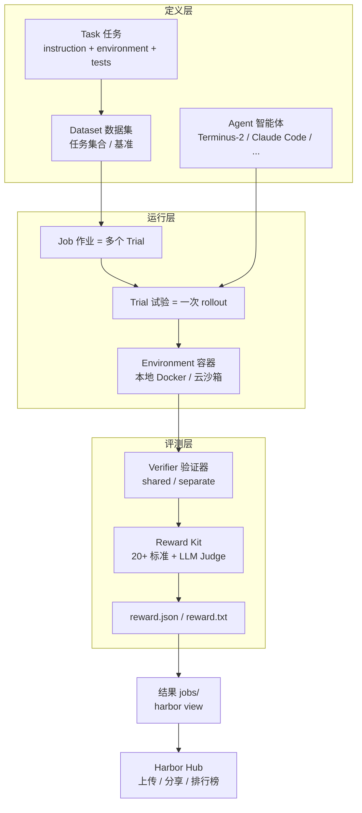

> **调研对象**：Harbor Framework 官方文档全站（https://www.harborframework.com/docs）
> **覆盖范围**：Motivation、Getting Started、Core Concepts、Migrating、Run Jobs、Tasks、Datasets、Sharing、Agents（含 Terminus-2、ATIF）、Training Workflows、Reward Kit、Contributing 等全部章节。
> **一句话定位**：Harbor 是一个在 **容器环境** 中对 **智能体（agents）与模型** 进行 **评测、后训练与提示词优化** 的框架，由 Terminal-Bench 团队打造，是其任务格式的演进版本。

## 一、Motivation（为何构建 Harbor）

Harbor 是用于在容器环境中评测和优化智能体与模型的框架。团队在 2025 年 5 月发布 Terminal-Bench 后，意外发现它被用于诸多场景：构建自定义评测、优化提示词、运行强化学习（RL）、生成 SFT 轨迹、CI/CD 智能体测试等。同时也认识到「**大规模定义与管理容器化任务非常困难**」，因此构建 Harbor 来简化这件事。

Harbor 提供以下能力：

- 面向环境、智能体、任务的 **简单、模块化接口**
- **预集成所有主流 CLI 智能体**
- 主流基准与数据集的 **注册中心（registry）**
- 与云沙箱厂商（Daytona、Modal、E2B、Runloop、Tensorlake、LangSmith 等）集成以实现 **横向扩展**
- 与优化框架（SkyRL、GEPA 等）集成以优化智能体

---

## 二、Getting Started（快速开始）

### 2.1 安装

```bash
# 使用 uv（推荐）
uv tool install harbor

# 或使用 pip
pip install harbor
```

### 2.2 核心命令

```bash
harbor --help              # 查看所有命令
harbor run --help          # 评测/生成 rollout 的主命令
harbor dataset list        # 查看已注册数据集
```

### 2.3 运行评测的几种方式

| 场景 | 命令 |
|------|------|
| 运行已注册数据集 | `harbor run -d "<org/name>" -m "<model>" -a "<agent>"`（自动下载） |
| 运行本地数据集 | `harbor run -p "<path/to/dataset>" -m "<model>" -a "<agent>"` |
| 云沙箱运行 | `harbor run -d "..." -m "..." -a "..." --env "daytona" -n 32` |

> 💡 使用 API 模型 + 云沙箱时，trial 由「计算受限」变为「I/O 受限」，因此可远超 CPU 核数并发（示例并发 32）。沙箱化智能体评测通常较慢（多轮 + 命令执行耗时），**横向扩展是加速实验的唯一可行方式**，推荐用 Daytona 等云沙箱。

---

## 三、Core Concepts（核心概念）

| 概念 | 含义 |
|------|------|
| **Task（任务）** | 单个 instruction + 容器环境 + 测试脚本，以 Harbor 任务格式的目录形式实现，用于评测智能体与模型 |
| **Dataset（数据集）** | 任务的集合，通常对应一个基准（如 Terminal-Bench、SWE-Bench Verified），可经 registry 分发 |
| **Agent（智能体）** | 完成任务的程序，通过实现 `BaseAgent` 或 `BaseInstalledAgent` 接口定义，可经 `agent.user` 配置运行的 OS 用户 |
| **Container environment（容器环境）** | 通常用 Dockerfile 定义的容器；`BaseEnvironment` 提供统一交互接口，内置支持多家云运行时 |
| **Trial（试验）** | 智能体完成任务的一次尝试，即「产出 reward 的 rollout」，由 `TrialConfig` 配置 |
| **Job（作业）** | trial 的集合，可包含多个数据集/智能体/任务/模型，由 `JobConfig` 配置；底层生成大量 TrialConfig 并行运行 |

定义 `job.yaml` / `job.json` 后可运行：`harbor run -c "<path/to/job.yaml>"`；也可通过 `harbor run` 的命令行 flag 创建临时 job。

---

## 四、Migrating from Terminal-Bench（从 Terminal-Bench 迁移）

Harbor 由 Terminal-Bench 同一团队打造，其任务格式是对 Terminal-Bench 格式的迭代，解决了后者的一些局限。两种格式的文件树差异：

**Terminal-Bench 格式**

```text
docker-compose.yaml
task.yaml
solution.sh
run-tests.sh
tests/
    test_outputs.py
    ...
```

**Harbor 格式**

```text
instruction.md
task.toml
environment/
    Dockerfile
solution/
    solve.sh
tests/
    test.sh
```

Harbor 提供从 TB 到 Harbor 的迁移映射器（mapper），但并非完美，部分高度定制任务需手动迁移：

```bash
harbor task migrate -i "<path/to/terminal-bench/task(s)>" -o "<path/to/harbor/task(s)>"
```

> 📌 **默认 Linux**：从 TB 迁移的任务保持 Linux 目标，除非在 `task.toml` 显式设置 `[environment].os = "windows"`。`os` 字段默认 `"linux"`，故迁移器对现有任务无需改动。

---

## 五、Tasks（任务）

### 5.1 任务结构与创建

用 `harbor init --task "<org>/<name>"` 初始化任务，生成 instruction.md、task.toml、environment/、solution/、tests/ 等结构；用 `harbor run -p "<path>" -a "<agent>" -m "<model>"` 评测。`task.toml` 采用分节嵌套配置（[task]/[metadata]/[verifier]/[agent]/[environment] 等），其中 metadata 完全自由。

> 📝 **关键机制（详见前期专项调研）**：
> - **reward 驱动评分**：测试脚本必须在 `/logs/verifier/` 产出 `reward.txt` 或 `reward.json`，是判定成败的唯一依据（默认读 json，回退 txt）。
> - **特殊路径**：`/logs/verifier/`、`/logs/agent/`、`/solution/`、`/tests/`。
> - **网络策略**：基线 + 阶段覆盖 + 运行时合并三层；默认 `public`；主机名精确匹配，子域名需 `*.example.com`。
> - **Verifier 环境**：shared（默认，与 agent 同容器）vs separate（隔离评分镜像，保护专有评分逻辑）。

### 5.2 Multi-step Tasks（多步任务）

多步任务让智能体在 **单一共享环境** 中顺序执行多个有序步骤，每步有独立 instruction、tests 和可选 setup hook，产出的每步 verifier 结果汇总为单一 trial 级 reward。适用于 **长程任务（含早停条件）、测试记忆等持续学习方法、观察智能体在已有工作上继续构建的能力**。

- **目录布局**：用 `steps/` 目录（每步一个子目录，含 instruction.md / tests / solution / workdir）替代任务根的单步文件；`environment/` 仍在根目录，环境构建一次、全步共享。
- **配置**：在 task.toml 用 `[[steps]]` 数组表声明，顺序即执行顺序。
- **workdir/ 与 setup.sh**：`steps/{name}/workdir/` 内容在 agent 运行前上传至容器 WORKDIR；保留文件 `workdir/setup.sh` 在上传后、agent 前执行（用于播种数据库、装一次性依赖等），非零退出会中止该步与后续步。
- **文件跨步持久**：容器文件系统全步共享，第 N 步留下的文件对 N+1 可见（需注意文件名冲突可能覆盖）。
- **早停 min_reward**：标量（基于 `rewards["reward"]`）或字典（按各键阈值）；任一不达标即中止；缺失 reward 视为 -inf。
- **trial 级聚合 multi_step_reward_strategy**：`"mean"`（默认）或 `"final"`（末步为端到端验证时适用；但早停时 final 会取被中止步的结果）。
- **每步 artifacts**：每步验证后采集一次，路径为任务级 + trial 级 + 步级的有序拼接。

### 5.3 Managing Resources（资源管理）

任务在 task.toml 的 `[environment]` 声明 CPU/内存/存储/GPU/TPU。CPU 与内存通过 **强制策略（enforcement policies）** 应用；存储/GPU/TPU 在 provider 支持时透传。所有字段可选，省略则用 provider 默认规格（Harbor 不注入默认值）。

| 策略 | 含义 | 需要 cpus/memory_mb? |
|------|------|----------------------|
| `auto` | 用 provider 默认模式 | 否 |
| `limit` | 仅硬上限 | 是 |
| `request` | 仅预留，无上限 | 是 |
| `guarantee` | 预留 + 硬上限 | 是 |
| `ignore` | 不向 provider 传值 | 否 |

通过 `--cpus` / `--memory` 或 job/trial config 设置策略；用 `--override-cpus`、`--override-memory-mb`、`--override-gpus`、`--override-tpu` 等在运行时覆盖。Harbor 在 job 启动时校验策略与 provider 支持，不支持的组合会在 trial 运行前失败。存储支持 Daytona/Islo/Runloop/GKE 等；GPU 支持 Modal/GKE/Daytona；TPU 仅 GKE。

### 5.4 Windows Tasks

通过 `[environment].os = "windows"` 面向 Windows 容器，需 Windows 主机 + Docker Desktop 处于 Windows 容器模式；容器内路径、文件传输、命令执行、脚本发现均自动适配（Windows 用 C: 盘等价路径、`solve.bat` / `test.bat`）。daemon 模式不匹配时 Harbor 会快速失败并报清晰错误。

### 5.5 Publishing a Task（发布任务）

通过 Harbor registry 在组织内外分享任务，可 **公开（所有人可见可用）** 或 **私有（仅发布组织成员可见）**。

- **前置**：`harbor auth login`（GitHub 登录，新账号默认以 GitHub 用户名建组织）→ `harbor auth status` 验证。
- **旧任务补 [task] 段**：`harbor task update "<path>" --org "<org>"`（批量加 `--scan`）。
- **发布**：`harbor publish "<path>"`（支持多任务、整目录）；选项 `-t/--tag`（默认含 latest）、`-c/--concurrency`、`--public`（默认私有）。
- **publish 做了什么**：计算并上传任务归档、从 task.toml 解析元数据与 digest、在 registry 注册版本，输出 registry 包页面链接。

---

## 六、Datasets（数据集）

数据集是用于评测与训练的任务集合，有时定义跨任务聚合 reward 的自定义指标。任务可属于多个数据集，可创建组合基准（如从多个基准各取 10 个任务）。

- **本地数据集**：`harbor run -p "<path>" -a "<agent>" -m "<model>"`
- **发布数据集**：`harbor run -d "my-org/my-dataset@1.0" -a "<agent>" -m "<model>"`（公开/私有可见性同任务）

### 6.1 Custom Metrics（自定义指标）

指标定义如何跨任务聚合 reward。默认对各任务 reward 取平均、缺失视为 0。需自定义逻辑或不同的缺失处理时，创建 `metric.py`（`harbor init --dataset "<org>/<name>" --with-metric` 自动生成并加入 dataset.toml）。脚本需接收 `-i/--input-path`（rewards JSONL）与 `-o/--output-path`（输出 JSON）；本地数据集会自动使用 metric.py。

### 6.2 Adapters（适配器）

要把新基准/数据集加入 Harbor，需编写 **adapter** 将原始基准任务翻译为 Harbor 格式。文档分「Human Guide」与「Agent Guide（AI 代理应遵循的完整 schema 规范）」。可用 `harbor adapter` 系列命令交互式 scaffold 新适配器、列出可用数据集等。

---

## 七、Agents（智能体）

Harbor 预集成多数主流智能体：**Terminus-2、Claude Code、Copilot CLI、Codex CLI、Gemini CLI、OpenHands、Mini-SWE-Agent** 等（`harbor run --help` 查看 `--agent` 列表）。可在不改 Harbor 源码的前提下集成自有智能体。

| 类型 | 说明 |
|------|------|
| **External agents** | 通过 `BaseEnvironment` 接口（通常用 `exec` 执行 bash）与环境交互；实现 `BaseAgent`（name / version / setup / run） |
| **Installed agents** | 直接装入容器并以 headless 模式运行（多数智能体的集成方式，可携带自定义工具）；实现 `BaseInstalledAgent`（install / run / populate_context_post_run），`exec_as_root` / `exec_as_agent` 自动处理日志、环境变量合并、错误处理 |

运行自定义智能体：`harbor run -d "<dataset@version>" --agent-import-path path.to.agent:SomeAgent`。

### 7.1 Terminus-2（参考智能体）

Harbor 的参考智能体实现，定位为研究预览，用于评估语言模型在终端环境的能力，作为高性能中立测试床。核心特性：

- **单工具设计（Mono-tool）**：以交互式 tmux 会话为唯一工具，发送按键、滚动输出、启动子 shell，自然交互任何终端应用，无需为每种交互定制工具。
- **独立执行**：智能体逻辑运行在独立 Python 进程（与 Docker 容器分离），支持远程连接、隔离执行、灵活部署。
- **自治优先**：执行中 **从不向用户请求输入**，端到端独立完成任务、自主纠错；因完全自治，目前仅推荐用于沙箱环境。
- **对话历史管理**：用 3 步子智能体流程（Summary → Question → Answer）做主动/被动摘要，在长任务中控制上下文窗口。
- **丰富配置**：parser（json/xml）、api_base、temperature、max_turns、enable_summarize、reasoning_effort、max_thinking_tokens、collect_rollout_details（RL 训练用，收集 token id 与 logprob）等。

### 7.2 Agent Trajectory Format（ATIF）

Harbor 定义了标准化的智能体轨迹交换格式（ATIF），用 Pydantic 模型构建，可导出 JSON、校验轨迹文件，覆盖 user step、含工具调用的 agent step 等，便于 SFT 数据集生成、轨迹分析与跨智能体互操作。

---

## 八、Reward Kit（奖励工具包）

Reward Kit 让你针对智能体的 **工作区与轨迹** 设计 verifier，将分数写入 JSON 文件，**零外部依赖**。它是独立 Python 包（可独立或配合 Harbor 使用），通过 **目录结构** 定义 verifier——每个文件夹映射一个 reward，易读、易分享、易扩展，默认所有标准并行评估。

### 8.1 设计动机与原则

写 verifier 常是建任务中最繁琐的部分，主流基准的 verifier 往往是难读、难扩展、难复用的复杂脚本，导致样板代码复制粘贴引入隐蔽错误。Reward Kit 通过可复用组件解决此问题。四大原则：**简单性**（目录结构即定义）、**复用与分享**（纯文件、git 版本化）、**零样板**（20+ 内置标准 + 原生 LLM/Agent-as-a-Judge）、**隔离性**（隔离文件系统快照运行，互不干扰）。

### 8.2 使用方式

```bash
uv tool install harbor-rewardkit
# 需读图片/文档（PDF/DOCX/PPTX/XLSX）时
uv tool install harbor-rewardkit[all]
```

```bash
#!/bin/bash
uvx --with harbor-rewardkit@0.1 rewardkit /tests
```

它发现 `/tests/` 中所有标准、针对工作区 `/app` 运行、把结果写入 `/logs/verifier/reward.json`（如 `{ "reward": 0.75 }`）。

### 8.3 三类标准

- **内置标准（20+）**：覆盖文件、命令、JSON、CSV、HTTP、图片、轨迹等，如 `rk.file_exists()`、`rk.file_contains()`、`rk.command_succeeds()`。
- **自定义标准**：用 `@criterion` 装饰器，首参恒为 `workspace: Path`，返回 `bool` 或 `float`，可带权重与自定义参数。
- **Judge 标准**：通过可复用 TOML 文件配置 LLM-as-a-Judge / Agent-as-a-Judge，支持 provider routing 在不改 rubric 的前提下切换厂商。API key 通过 task.toml 的 `[verifier.env]` 传入。

---

## 九、Run Jobs / Sharing（运行作业与分享）

### 9.1 运行与查看结果

`harbor run` 创建 job，默认存于 `jobs/` 目录，含 job/trial 的 config.json、result.json、agent/（recording.cast、trajectory.json）、verifier/（ctrf.json、reward.txt、test-stdout/stderr）。

**Web 结果查看器**：`harbor view jobs` 启动本地服务（默认 127.0.0.1:8080），可浏览 job、检查 trial、逐步查看轨迹（含工具调用、多模态内容）、分析 token/计时、并排对比多 job、浏览 artifacts、AI 摘要失败原因；支持键盘导航（j/k/Enter/Esc）。

### 9.2 Artifact Collection（产物采集）

Harbor 可在每个 trial 完成后自动从沙箱采集文件（模型输出、日志、生成文件等）。在任务/trial/步级通过 `artifacts =` 声明路径；产物快照入 trial 目录。隔离 verifier 场景下，artifacts 是从 agent 环境向 verifier 环境传递文件的标准通道（如 `artifacts = ["/logs/agent/trajectory.json"]` 实现轨迹评分）。

### 9.3 Cloud Sandboxes（云沙箱）

容器化任务因启停开销、等待 LLM API、等待命令执行而慢，横向扩展是加速实验的唯一可行方式。云沙箱把命令执行移到云端，使 trial 从计算受限变为 I/O 受限，可远超 CPU 核数并发。

- **支持厂商**：Daytona、Modal、E2B、Runloop、Tensorlake、Islo、CoreWeave Sandboxes、W&B Sandboxes、LangSmith 等。
- **用法**：`harbor run -d "..." -m "..." -a "..." -e daytona -n "<并发数>"`（团队在 14 核 MacBook Pro 上可并行多达 100 个 trial）。
- **多容器部署**：仅 Daytona、Islo、LangSmith 支持（需 `environment/docker-compose.yaml`）；其余厂商需用单容器或切换 provider。
- **Daytona 提示**：账号默认有联网限制，用优惠码 `HARBOR_NETWORK` 可解除。

### 9.4 Jobs 上传与分享

Job 是运行结果，上传至 **Harbor Hub** 可获得可分享链接。`harbor upload jobs/my-job`（默认私有，`--public` 公开，`--share-org`/`--share-user` 定向分享）；`harbor run ... --upload` 边跑边上传；`harbor job resume -p ... --upload` 补齐缺失 trial。下载用 `harbor job download <id>` / `harbor trial download <id>`。任务与数据集作为 registry 包（`org/name@tag`）分享，可见性可后续用 `harbor task/dataset visibility` 更改。

### 9.5 Submit to a Leaderboard（提交排行榜）

运行基准并上传 job 后，用 `harbor leaderboard submit` 进入官方排行榜评审队列。流程：`harbor run`（多数排行榜要求每任务至少 5 次尝试，加 `-k 5`）→ `harbor upload`（记下 job id）→ `harbor leaderboard submit --leaderboard <slug> --job-id <uuid> --metadata ./metadata.yaml`。提交后为 pending，待管理员审核发布。目前仅 `terminal-bench/terminal-bench-2-1` 可提交。

---

## 十、Training Workflows（训练工作流）

Harbor 支持后训练场景：通过收集 rollout 细节（token id、logprob，由 Terminus-2 的 `collect_rollout_details` 开启）生成 SFT 轨迹数据集，并可与 SkyRL、GEPA、Tinker 等框架集成做 RL 与提示词优化。轨迹经 ATIF 标准化，便于跨智能体复用与导出。

---

## 十一、Contributing & Roadmap（贡献与路线图）

**贡献**：在 GitHub 仓库提 issue（bug/特性请求）或 PR；也可加入 Discord 讨论。

**Roadmap（节选）**：

- **基准与任务**：将所有兼容基准纳入 registry、构建新基准（如 Terminal-Bench 3.0）、多轮对话评测（含模拟用户）、从生产智能体状态捕获并映射为任务。
- **集成**：接入更多沙箱厂商（如 Vercel sandbox）、集成 Tinker / SkyRL 做 RL；**已完成** LLM-as-a-Judge 一等支持。
- **基础设施**：改进可视化与分析工具、沙箱快照、托管存储层（"任务版的 PyPI"，含私有 registry）、托管 rollout 基础设施。

---

## 十二、整体架构与工作流



---

## 十三、关键结论小结

1. **统一框架**：Harbor 用一套模块化接口（环境/智能体/任务）覆盖评测、后训练、提示词优化三大场景，是 Terminal-Bench 的演进。
2. **清晰的概念分层**：Task → Dataset → Trial → Job 自底向上组织，Environment 与 Agent 通过统一接口解耦。
3. **任务格式灵活**：单步/多步、Linux/Windows、可声明 CPU/内存/GPU/TPU、三层网络策略、共享/隔离 verifier，reward 文件驱动评分。
4. **智能体生态完善**：预集成主流 CLI 智能体，自带参考实现 Terminus-2（单工具 + 自治），支持自定义 External/Installed 智能体与 ATIF 标准轨迹。
5. **Reward Kit 降本**：目录即 verifier、20+ 内置标准、原生 LLM/Agent-as-a-Judge、隔离评估，消除 verifier 样板代码。
6. **规模化与协作**：深度集成多家云沙箱实现横向扩展；registry + Harbor Hub 支持任务/数据集/job 的发布、分享与排行榜提交。

