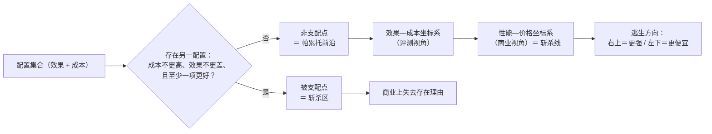

## 1. 帕累托前沿（Pareto Frontier）

### 1.1 概念

帕累托前沿来自经济学中的帕累托最优（Pareto Optimality），用于描述**多目标权衡**下的最优解集合。在模型评测和选型语境下，通常只有两个目标：

- **效果**（得分、能力）：越高越好
- **成本**（Token 消耗、耗时、API 价格）：越低越好

当两个目标相互冲突时（更好的效果通常意味着更高的成本），不存在"全维度最优"的单一解，只存在一条**权衡边界**——这就是帕累托前沿。

**支配（Domination）**：配置 A 支配配置 B，当且仅当 A 在**所有维度上不劣于 B，且至少一个维度严格更优**：

> A 支配 B ⇔ A 的成本 ≤ B 的成本 且 A 的效果 ≥ B 的效果，且至少一项取严格不等号。

**非支配点 / 帕累托前沿**：不被任何其他配置支配的点的集合。把这些点按成本升序连接，即得到**帕累托前沿曲线**。

**判定口诀**：如果一个配置存在"成本不更高、效果不更差、且至少一项更好"的对手，它就被支配（不在前沿上）；否则它在前沿上。

### 1.2 关键性质

1. **两端必然占位**：效果最高的点和成本最低的点必然位于前沿两端（若并列，各端只保留"该极端值下的最优者"）。
   - 效果最高点：没有点效果比它更高，故无法被支配；
   - 成本最低点：没有点成本比它更低，故无法被支配。
   - **推论**："位于前沿"本身并不是强 claim——只要你是全体中效果最高或成本最低，就必然占位。
2. **单调性**：前沿上的点按成本升序排列时，效果严格递增（否则中间点会被相邻点支配）。前沿是一条从"低成本-低效果"到"高成本-高效果"的单调曲线。
3. **中间点 = 权衡点**：前沿中段的每个点代表一种效果与成本的折中，没有绝对优劣，取决于决策者对效果增量的边际偏好。

### 1.3 含义解读（易误读点）

- **位于前沿 = "效果-成本"权衡下不存在全面更优的替代**，不等于"性价比最优"。
- **关键看位置**：
  - 右端点：效果最高、成本也最高——用最高成本换最高效果；
  - 左端点：成本最低、效果也最低——用最低效果换最低成本；
  - 中段点：效果与成本的折中。
- **常见误读**：某模型"同时位于 Token、耗时两条帕累托前沿"，往往只是因为它是**效果最高的点**（数学上必然），但它同时可能是 Token 和耗时**最高**的配置——属于"高效果-高成本"端点。评估时务必同时看它的邻居点：是否存在"效果接近但成本低得多"的前沿点。

### 1.4 如何绘制

**标准构造算法**（输入：N 个配置，各有效果 eᵢ、成本 cᵢ）：

1. 按成本升序排序（成本相同则按效果降序排）；
2. 初始化前沿集合 F = ∅，当前最高效果 maxE = −∞；
3. 依序遍历：
   - 若 eᵢ > maxE：将该点加入 F，更新 maxE = eᵢ；
   - 否则：该点被支配，跳过；
4. 把 F 中的点按成本升序连线，即得帕累托前沿曲线。

**等价简化判定法**：

- 每个成本水平只保留效果最高的点；
- 剔除所有"效果不如成本更少的点"的点（即被更便宜的对手支配）；
- 注意边界：成本相同的点里效果差者被剔除；效果相同的点里成本高者被剔除。

**绘制注意事项**：

- 坐标轴建议：横轴 = 成本（Token / 耗时 / 价格），纵轴 = 效果得分；成本跨度大时用**对数轴**；
- 指标口径必须一致（如都用 P50、都用"每任务总成本"），口径混用会画出假前沿；
- 前沿只在**明确的范围集合**内成立（如"某一价位段的模型"），集合变化前沿随之变化——表述时必须限定范围。

### 1.5 示例（示例数据，仅用于演示方法）

假设有 5 个配置（效果得分、成本为相对值）：

| 配置 | 效果得分 | 成本 |
|---|---|---|
| A | 70 | 2 |
| B | 80 | 4 |
| C | 75 | 5 |
| D | 78 | 8 |
| E | **85** | 10 |

**判定过程**：

- C（75, 5）：被 B 支配（B 得分 80 > 75 且成本 4 < 5）→ 剔除；
- D（78, 8）：被 B 支配（B 得分 80 > 78 且成本 4 < 8）→ 剔除；
- A（70, 2）：成本最低，无人可比 → 保留（左端点）；
- E（85, 10）：效果最高，无人可比 → 保留（右端点）；
- B（80, 4）：介于 A 与 E 之间，效果和成本都严格居中，无支配者 → 保留（中间权衡点）。

**帕累托前沿 = {A, B, E}**，前沿曲线：A(2,70) → B(4,80) → E(10,85)。

**解读**：

- 若预算紧张选 A，追求极限效果选 E；
- B 是典型的"甜点位"：比 A 多花 2 单位成本换 10 分效果；
- C、D 在任何偏好下都不该选——存在"更便宜且更聪明"的替代，商业上无存在理由（这就是下文"斩杀"的含义）。

---

## 2. 斩杀线（Kill Zone）

### 2.1 概念与来源

- **词源**：游戏术语，指角色血量低于某个阈值即可被一击必杀——比赛实际上已提前结束。
- **进入 AI 圈**：2026 年 8 月起成为中文 AI 圈热词（知乎热榜曾出现"为什么大家都说 DeepSeek 已经成为大模型的斩杀线"），英文侧对应 **Kill Zone**。
- **代名词**：DeepSeek。起因是 **DeepSeek-V4-Flash 正式版 API（2026 年 7 月 31 日公测）**相比初版能力大幅提升、价格反而更低，在第三方评测机构（Artificial Analysis）的"价格—智能指数"图上成为划线的那个点。

### 2.2 含义

> 当一款模型拿到某一档能力，同时维持足够低的调用成本，那些**能力不如它、价格却比它贵**的竞品，就会落入"斩杀区"——商业上再没有存在的理由。

- **判定规则（简单粗暴）**：比斩杀线基点贵，并且不如基点聪明，统统划进斩杀区；
- **两条逃生路线**：要么**更强**（往右上角移动），要么**更便宜**（往左下角移动）；而"便宜很难"，所以各家旗舰都在往"更强"的方向上卷；
- **动态性**：斩杀线不是固定的，而是被更便宜、更强的模型不断抬升。

### 2.3 如何绘制

**方法 A：横纵矩形法**

1. 选基点：如 DeepSeek V4 Flash 0731 正式版，坐标为（价格 P₀，得分 S₀）；
2. 以基点画横线（y = S₀）与竖线（x = P₀）；
3. 斩杀区 = 由基点向右下方延伸的矩形区域：**x ≥ P₀ 且 y ≤ S₀**（更贵且不更聪明）；
4. 矩形内的模型理论上失去意义；逃离方向：右上（更强）或左下（更便宜）。

**方法 B：前沿线法**

1. 把主流模型放进"每任务价格（横轴，对数）— 智能指数（纵轴）"坐标系；
2. 按 1.4 节的算法构造帕累托前沿；
3. 前沿即"斩杀线"；落在线右侧且不更高的点 = 斩杀区（前沿右下方的点全部被斩杀）。

**两者关系**：矩形法是"单基点"的简化版；前沿线法是"多点包络"的完整版。前沿上的每个点都是潜在的"斩杀线基点"。

### 2.4 案例与动态（公开事件）

| 时间 | 事件 | 斩杀线状态 |
|---|---|---|
| 2026-07-31 | DeepSeek-V4-Flash 正式版 API 公测，能力大增且降价 | V4 Flash 成为斩杀线 |
| 2026-08 初 | "斩杀线"出圈，行业讨论：GPT、Claude、GLM、Kimi 等被评价为"都在逃离斩杀线" | 行业讨论期 |
| 2026-09-10 | DeepSeek-V4.1-Flash 上线（全新结构系列最小尺寸模型），Flash 系列全系降价 | 斩杀线更新为 V4.1 Flash |

**用 1.5 的示例演示"斩杀"**：配置 C（75 分、成本 5）被配置 B（80 分、成本 4）严格支配——更便宜且更聪明，C 就是"被斩杀"的典型；D 同理。

### 2.5 已知局限

- 斩杀线用**单维度打分 + 名义价格**评判，模型能力是多维的（推理、代码、多模态、Agent 长程任务……），单分可能掩盖差异；
- 实际成本不止名义价格：还涉及缓存命中率、上下文复用效率、不同计费协议、任务粒度等（所谓"Token 经济学"：价值 = 用量 / 价格，并非越便宜越好，而是用户愿意把多少 token 投给它）；
- 因此斩杀线更适合作为**竞争格局的直觉框架**，不宜直接当作选型的唯一依据。

---

## 3. 两者的关系

**一句话**：斩杀线就是帕累托前沿在模型商业竞争里的说法——**站在前沿上的人定义规则，落在前沿右下方的人被淘汰**。

| 维度 | 帕累托前沿 | 斩杀线 |
|---|---|---|
| 学科出身 | 经济学 / 多目标优化 | 游戏术语 → 产业黑话 |
| 坐标系 | 效果—成本（Token/耗时/价格） | 性能（智能指数）— 价格 |
| 核心对象 | 非支配点集合 | 基点模型（如 DeepSeek V4 / V4.1 Flash） |
| 线的角色 | 权衡边界 | 生死边界 |
| 线的下方 | 被支配点 | 斩杀区（更贵且更差） |
| 语言 | 支配 / 非支配 | 斩杀 / 被斩杀 / 逃离斩杀线 |
| 动态性 | 集合变化（换点/换指标） | 被更便宜更强的模型不断抬升 |

---

## 4. 速查：三步判断

**判断一个配置是否在帕累托前沿上**：

1. 明确范围集合与指标口径（得分、成本指标、统计口径等）；
2. 找是否存在另一个配置：成本不更高、效果不更差、且至少一项更好；
3. 存在 → 被支配（不在前沿，属于"被斩杀"）；不存在 → 非支配（在前沿上）。若在前沿上，再看位置是两端还是中间权衡点，并对比邻居点的"效果增量 / 成本增量"。

**判断一个模型是否是斩杀线基点**：

1. 在性能—价格坐标中找到它；
2. 检查是否存在"更便宜且不更差"的模型——若没有，它就是当前前沿（斩杀线）；
3. 落在线右侧（更贵）且不更高（更差）的模型 = 被斩杀；
4. 动态跟踪：每次竞品发布更便宜/更强的模型，都要重新计算。

---

## 5. 参考来源

- 36氪《DeepSeek、智谱、阿里、腾讯，谁是大模型真正的斩杀线？》：https://36kr.com/p/3964795330780423
- ZAKER《荣耀高管谈 DeepSeek 斩杀线：法拉利性能仅电动摩托价格》：https://app.myzaker.com/news/article.php?pk=6a71bab48e9f0914ad4dc980
- ZAKER《DeepSeek 斩杀线，火了》：https://app.myzaker.com/news/article.php?pk=6a72e895b15ec0465f15d33e
- 掘金《DeepSeek 的"斩杀线"：国产大模型如何从追赶者变成规则制定者》：https://juejin.cn/post/7669997158734020634
- 腾讯网《毒圈缩圈：AI 大模型的"斩杀线"还在上移》：https://view.inews.qq.com/a/20260805A054PE00
- 网易《梁文锋和马斯克盯上同一高地，夺刀划出新"斩杀线"》：https://c.m.163.com/news/a/L47SUOF905508TBC.html
- 钛媒体《成本拉低 100 倍，梁文锋把 Claude 拉进"斩杀线"》：https://www.tmtpost.com/8092232.html

